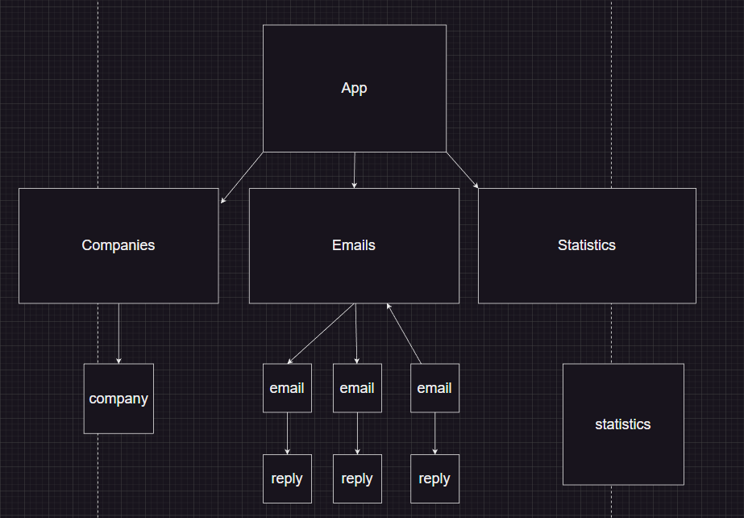
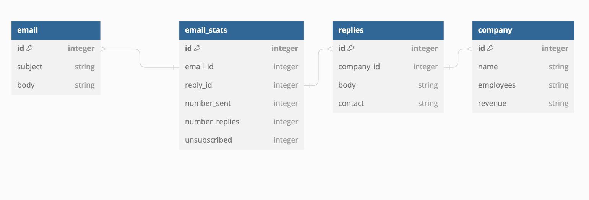
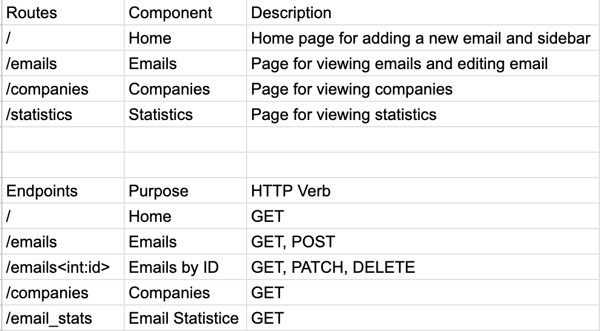
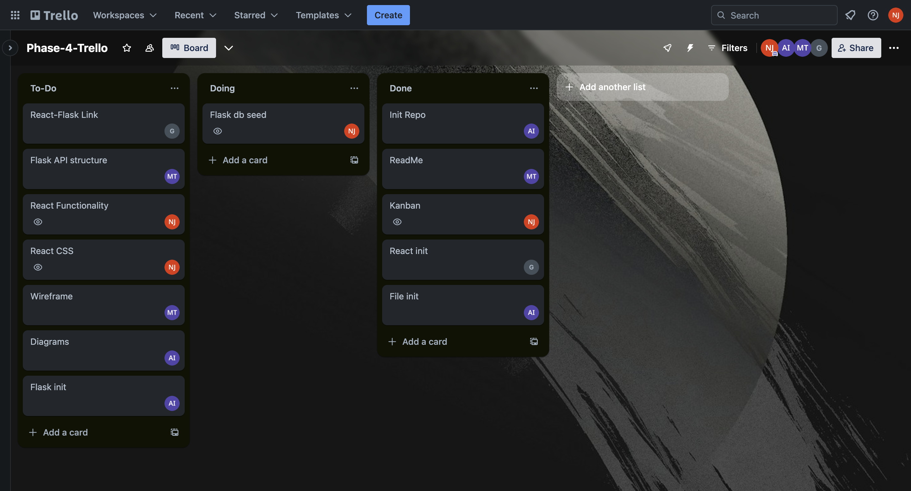

# Email Tracker Project

## Description

Sales enablement software for representatives to track email statistics.

## Wireframe

## User Stories

1. Representatives can add/delete new email templates. (CRUD / Create)
2. Representatives can read and update email statistics.
3. Create new email form for representatives.

## Tree Diagram of React component

## Schema (Relationships, columns, validations)

## API Routes

## 3 Stretch Goals

1. Search bar for emails.
2. Representatives can track company-wide statistics for emails.
3. Add representatives to track personal emails and statistics.

## KanBan Board

